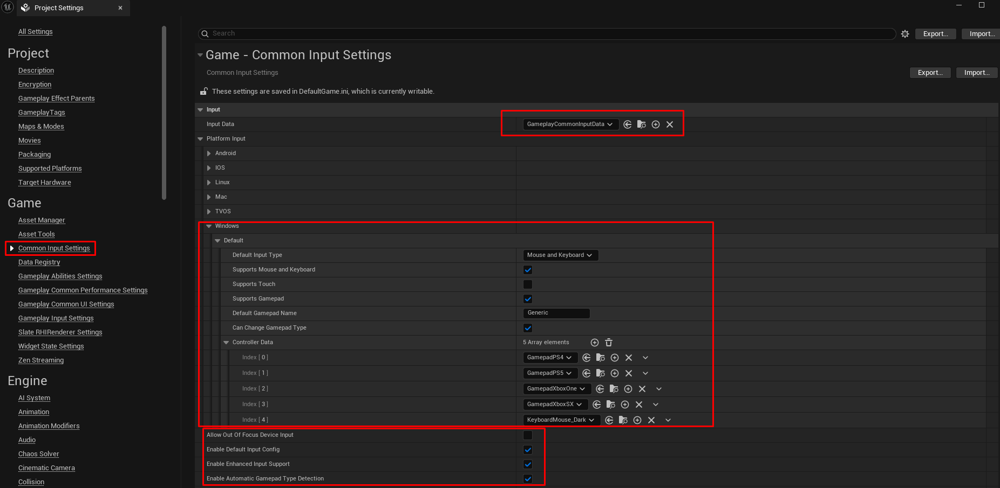

# Inputs, Icons and Global Settings

Common UI relies heavily on Data Assets and Project Settings. If you have ever wondered why your controller isn't working with the UI or why keyboard prompts appear while playing on a gamepad, this configuration is the solution.

### 1. Enabling Enhanced Input in Common UI

Common UI must map Enhanced Input Actions to "universal" UI actions, such as Confirm (A/Cross) and Back (B/Circle).

#### Step A: Creating Input Data

You need a Data Asset to bridge Enhanced Input and Common UI.

1. Right-click in the Content Browser.
2. Navigate to Blueprint Class > search for `CommonUIInputData` and create it.
3. Name it `BP_CommonInputData` (or use the provided `GameplayCommonInputData`).


You can use what is already available in the plugin, named `GameplayCommonInputData`


Inside the Data Asset:

* **Default Click Action**: Select your "Confirm/Interact" Input Action (e.g., `IA_UI_Confirm`).
* **Default Back Action**: Select your "Cancel/Back" Input Action (e.g., `IA_UI_Back`).


These actions should be the same as the ones you use in gameplay (IA\_Confirm, IA\_Cancel).


#### Step B: Project Settings

Now, tell the engine to use this file.

1. Go to Project Settings > Game > Common Input Settings.
2. Under Input Data, select your `BP_CommonInputData`.
3. Ensure Enable Enhanced Input Support is checked. _(Note: While marked as experimental by Epic, it is stable in UE 5.5+)._

### 2. The "Generic" Controller Trick (Gamepad Icons on PC)

By default, Unreal assumes Windows users are on Mouse/Keyboard. To support dynamic icon switching, we must configure Controller Data.

Common UI uses `CommonInputBaseControllerData` to identify which icon (Brush) to display for each button.

1. Go to Project Settings > Game > Common Input Settings.
2. Under Platform Input, find the Windows section.
3. Set Supports Gamepad to `True`.
4. Change Default Gamepad Name to `Generic`.
5. Under Controller Data, add the 5 Controller Data assets provided in the plugin (or your custom ones).

> Why "Generic"? By setting the Windows Controller Data to a generic set (e.g., Xbox style), the UI system will instantly swap all prompts to gamepad icons the moment a controller button is pressed on PC.

<figure><figcaption></figcaption></figure>

### 3. Common UI Framework: Platform Traits

The Common UI Framework adds a layer of control for managing Platform Traits via C++. These are Gameplay Tags that define the capabilities of the current hardware.

* Examples: `Platform.Trait.Mobile`, `Platform.Trait.SupportsTouch`, `Platform.Trait.WeakHardware`.

#### How to Configure:

1. Go to Project Settings > Plugins > Common UI Framework.
2. You will see a list of Platform Traits.
3. You can add overrides per platform (e.g., adding the `Mobile` tag only for Android/iOS).

#### Using Traits in C++:

This is useful for loading different UI layouts based on the device.

<figure><figcaption></figcaption></figure>

#### How do I use this in C++?

This is extremely useful for loading different UIs (e.g., large virtual buttons on mobile, compact UI on PC).

```c++
// Exemplo de uso em qualquer Widget ou Actor C++
#include "GameplayTagsManager.h"
#include "CommonUISettings.h"

void UMyWidget::CheckPlatform()
{
    // Tag que queremos verificar
    FGameplayTag MobileTag = FGameplayTag::RequestGameplayTag(FName("Platform.Trait.Mobile"));

    // Verifica se a plataforma atual tem essa trait
    if (UCommonUISettings::GetPlatformTraits().HasTag(MobileTag))
    {
        // Ativar interface touch
        ActivateTouchControls();
    }
}
```

### 4. C++ Integration: Gameplay Bound Action Buttons

Once Inputs are configured, your C++ buttons—specifically `UGameplayBoundActionButton`—will function automatically.

* UGameplayBoundActionButton: An advanced version of `UGameplayButtonBase`. It automatically "binds" to an Input Action and displays the correct icon prompt (Brush) next to the text.
* How to use: In your Widget Blueprint, use a `GameplayBoundActionButton`. It will read the `BP_CommonInputData` to determine which icon to show.


For `GameplayBoundActionButton` to display icons correctly when `Enhanced Input Support` is enabled, the screen (usually a `UGameplayActivatableWidget`) must have the relevant Input Mapping Context (IMC) injected.


If you are using the Settings screen or a Menu, ensure the IMC containing your UI Input Actions is active; otherwise, the buttons will not know which keys/buttons to display.

<figure><figcaption></figcaption></figure>


If you prefer not to use `Enhanced Input Support`, you can use the standard Common UI method by utilizing `UniversalActions` directly and ignoring the IMC injection step. However, for a modern GAS and Enhanced Input workflow, the method described above is the standard for UE5.

